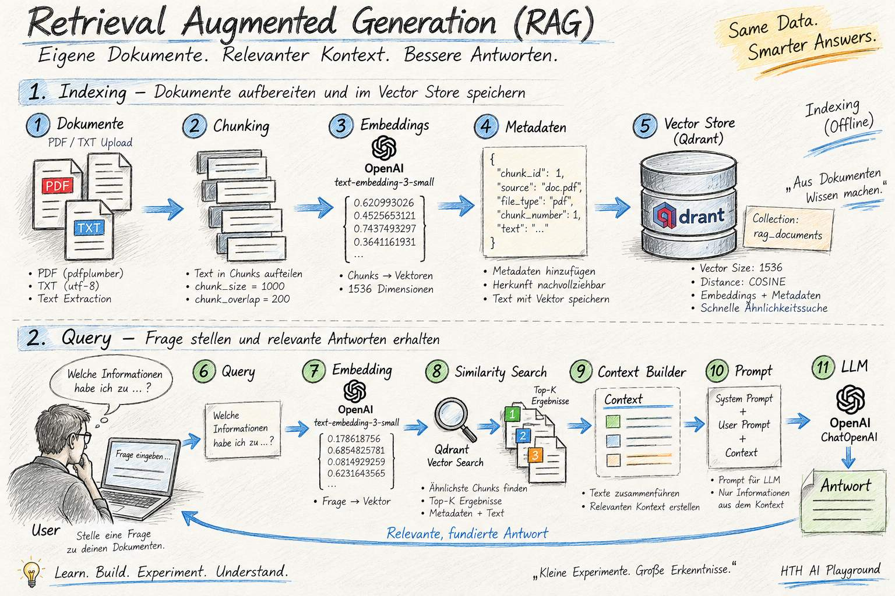
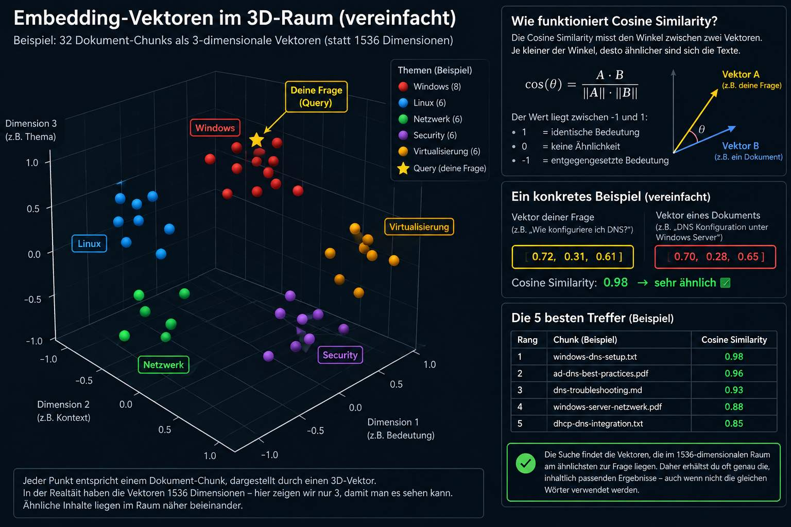
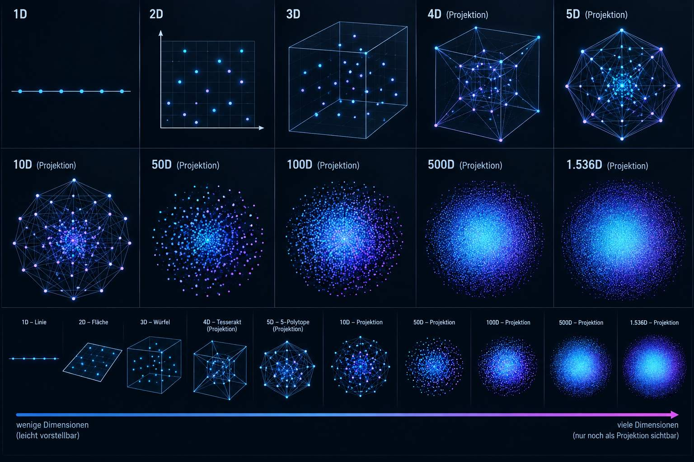

# Retrieval Augmented Generation (RAG) Pipeline -  Funktionsweise

<p></p>

 

Dieses Projekt dient als Laborumgebung, um die Funktionsweise einer
Retrieval Augmented Generation (RAG) Pipeline Schritt für Schritt
nachzuvollziehen.

Der Aufbau wurde bewusst nicht als kompakte LangChain-Chain umgesetzt,
sondern die einzelnen Prozesse werden sichtbar dargestellt.

## RAG Pipeline

```text
Dokumente
    ↓
Text Extraction
    ↓
Chunks
    ↓
Metadaten
    ↓
Embeddings
    ↓
Qdrant Vector Database
    ↓
Retrieval
    ↓
Context
    ↓
Prompt
    ↓
LLM
    ↓
Antwort
```

## 1. Dokumente

Über die Streamlit WebGUI können PDF und TXT Dateien hochgeladen werden.

- PDF → Text Extraction mit `pdfplumber`
- TXT → UTF-8 Text

## 2. Chunking

Die extrahierten Texte werden mit dem
`RecursiveCharacterTextSplitter` in kleinere Textabschnitte (Chunks)
aufgeteilt.

Aktuelle Konfiguration:

- `chunk_size = 1000`
- `chunk_overlap = 200`

## 3. Metadaten

Für jeden Chunk werden zusätzliche Metadaten erzeugt:

- `chunk_id`
- `source`
- `file_type`
- `chunk_number`
- `text`

Dadurch bleibt die Herkunft jedes Chunks nachvollziehbar.

## 4. Embeddings

Jeder Chunk wird mit OpenAI `text-embedding-3-small`
in einen Vektor umgewandelt.

Der erzeugte Embedding-Vektor besitzt:

```text
1536 Dimensionen
```

Die Embeddings werden im Labor zusätzlich angezeigt, sodass die
Dimensionen und die ersten Werte eines Vektors untersucht werden können.

## 5. Cosine Similarity

Um die Ähnlichkeit zwischen zwei Embeddings zu untersuchen,
wird die Cosine Similarity im Python-Code manuell berechnet.

Damit kann nachvollzogen werden, wie semantische Ähnlichkeit
zwischen Texten mathematisch bestimmt wird.

**Embedding Vektoren in einem 3D Raum (vereinfachte Darstellung)**
<p></p>

**Dimensionen (vereinfachte Darstellung)**
<p></p>


## 6. Manual Retriever

Der Manual Retriever berechnet die Ähnlichkeit einer Frage
zu allen vorhandenen Chunk-Vektoren.

```text
Frage
  ↓
Embedding
  ↓
Cosine Similarity mit allen Chunks
  ↓
Sortierung
  ↓
Top-K Chunks
```

Dieser Retriever bleibt im Labor bewusst erhalten, da er als
Referenz für den später verwendeten Qdrant Retriever dient.

## 7. Qdrant Vector Database

Qdrant wird lokal über Docker betrieben.

Die Collection:

```text
rag_documents
```

ist konfiguriert mit:

```text
Vector Size: 1536
Distance: COSINE
```

Die Embeddings und Metadaten werden als Qdrant Points gespeichert.

Ein Point besteht aus:

```text
Point
├── ID
├── Vector (1536 Werte)
└── Payload
    ├── chunk_id
    ├── source
    ├── file_type
    ├── chunk_number
    └── text
```

## 8. Qdrant Retriever

Der Qdrant Retriever verwendet den Embedding-Vektor der Frage
und sucht die ähnlichsten Points in der Collection.

```text
Frage
  ↓
Embedding
  ↓
Qdrant Vector Search
  ↓
Top-K Points
  ↓
Payload / Text
```

Der Manual Retriever und der Qdrant Retriever liefern dabei
für dieselbe Anfrage vergleichbare Similarity-Werte.

## 9. RAG Pipeline

Die eigentliche RAG Pipeline wurde in vier Schritte aufgeteilt:

### 10.1 Retrieval

Qdrant sucht anhand des Query-Vektors die relevantesten Chunks.

### 10.2 Context Builder

Die Texte der gefundenen Chunks werden zu einem gemeinsamen
Context zusammengeführt.

### 10.3 Prompt

Der Context wird zusammen mit der Benutzerfrage in einen
System Prompt und User Prompt integriert.

Der System Prompt weist das LLM unter anderem an, ausschließlich
Informationen aus dem bereitgestellten Context zu verwenden.

### 10.4 LLM

Der erzeugte Prompt wird mit `ChatOpenAI` an ein OpenAI LLM
übergeben.

Das LLM erzeugt daraus die finale Antwort.

## Gesamtablauf

```text
                    RAG LAB
                       │
              ┌────────▼────────┐
              │ PDF / TXT       │
              └────────┬────────┘
                       ↓
                Text Extraction
                       ↓
                    Chunking
                       ↓
                   Metadata
                       ↓
                  Embeddings
                1536 Dimensionen
                       ↓
              ┌─────────────────┐
              │     Qdrant      │
              │  Vector Store   │
              └────────┬────────┘
                       ↓
                   Retrieval
                       ↓
                    Context
                       ↓
                     Prompt
                       ↓
                      LLM
                       ↓
                    Antwort
```

## Ziel des Projekts

Das Projekt dient zunächst nicht als produktiver Chatbot,
sondern als technische Laborumgebung.

Ziel ist es, die einzelnen Komponenten einer RAG Pipeline
zu verstehen, bevor diese später mit einer kompakten
LangChain-Implementierung in einem eigentlichen Chatbot
zusammengeführt werden.

## Aktueller Projektstand

- [x] PDF/TXT Upload
- [x] Text Extraction
- [x] Chunking
- [x] Metadaten
- [x] OpenAI Embeddings
- [x] Cosine Similarity
- [x] Manual Retriever
- [x] Qdrant lokal via Docker
- [x] Qdrant Collection
- [x] Speicherung von Embeddings und Payloads
- [x] Qdrant Retriever
- [x] Context Builder
- [x] Prompt
- [x] LLM Integration
- [x] Erste funktionierende RAG Pipeline
