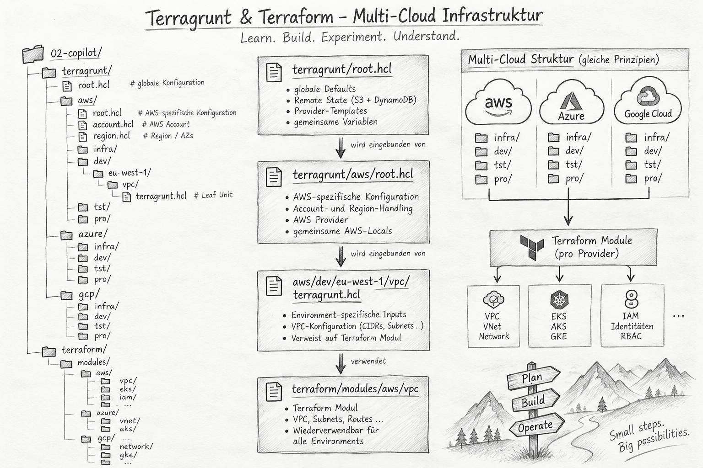

# 02 - Copilot: Multi-Cloud Terraform & Terragrunt

<p></p>


Dieses Projekt ist ein Experiment mit **GitHub Copilot Agent** und
**Infrastructure as Code**.

Ziel ist der Aufbau einer strukturierten Multi-Cloud-Infrastruktur mit:

- Terraform
- Terragrunt
- AWS
- Microsoft Azure
- Google Cloud
- GitHub Copilot / Agentic AI

Der Schwerpunkt liegt dabei nicht nur auf dem Ergebnis, sondern auf dem
Verständnis der Architektur, der Konfigurationshierarchie und der
Zusammenarbeit mit einem AI-Agenten.

> **Learn. Build. Experiment. Understand.**

---

## 1. Ziel des Experiments

Die Infrastruktur soll schrittweise für drei Cloud Provider aufgebaut werden:

```text
Multi-Cloud
│
├── AWS
│   ├── infra
│   ├── dev
│   ├── tst
│   └── pro
│
├── Azure
│   ├── infra
│   ├── dev
│   ├── tst
│   └── pro
│
└── GCP
    ├── infra
    ├── dev
    ├── tst
    └── pro
```

Dabei sollen die Cloud Provider konzeptionell eine vergleichbare
Environment-Struktur besitzen, ohne die provider-spezifischen technischen
Konzepte künstlich zu vereinheitlichen.

Beispielsweise:

| Konzept | AWS | Azure | GCP |
|---|---|---|---|
| Organisations-/Abrechnungsebene | Account | Subscription | Project |
| Netzwerk | VPC | VNet | VPC Network |
| Kubernetes | EKS | AKS | GKE |
| Identitäten | IAM | Entra ID / RBAC | IAM |
| Region | Region | Region | Region |
| Zonen | Availability Zones | Availability Zones | Zones |

---

## 2. Grundprinzipien

Das Projekt verfolgt einige zentrale Architekturregeln.

### Minimale Wiederholung

Konfiguration soll möglichst nur einmal definiert werden.

Ein Wert wird auf der höchsten sinnvollen Ebene definiert und von darunter
liegenden Ebenen wiederverwendet.

Beispiel:

```text
region.hcl
    │
    ├── region = eu-west-1
    └── azs
         │
         ├── dev
         ├── tst
         └── pro
```

Damit müssen Region und Availability Zones nicht in jedem Modul erneut
definiert werden.

### Trennung von Terraform und Terragrunt

**Terraform** beschreibt die eigentliche Infrastruktur.

**Terragrunt** übernimmt unter anderem:

- Environment-Konfiguration
- Account-/Subscription-/Project-Konfiguration
- Region
- Remote State
- Provider-Konfiguration
- Modulquelle
- Deployment-Parameter

---

## 3. Aktuelle Struktur

Der aktuelle Aufbau verwendet folgende Struktur:

```text
02-copilot/
│
├── terragrunt/
│   ├── root.hcl
│   │
│   ├── aws/
│   │   ├── root.hcl
│   │   ├── account.hcl
│   │   ├── region.hcl
│   │   │
│   │   ├── infra/
│   │   ├── dev/
│   │   │   └── eu-west-1/
│   │   │       └── vpc/
│   │   │           └── terragrunt.hcl
│   │   ├── tst/
│   │   └── pro/
│   │
│   ├── azure/
│   │   ├── infra/
│   │   ├── dev/
│   │   ├── tst/
│   │   └── pro/
│   │
│   └── gcp/
│       ├── infra/
│       ├── dev/
│       ├── tst/
│       └── pro/
│
├── terraform/
│   └── modules/
│       ├── aws/
│       │   └── vpc/
│       ├── azure/
│       └── gcp/
│
└── README.md
```

Die bestehende Struktur soll bewusst **nicht** um eine zusätzliche
`live/`-Ebene erweitert werden.

---

## 4. Terragrunt-Konfigurationshierarchie

Die AWS-Referenzimplementierung verwendet eine mehrstufige Konfiguration.

```text
terragrunt/root.hcl
        │
        ▼
terragrunt/aws/root.hcl
        │
        ├── account.hcl
        ├── region.hcl
        │
        ▼
aws/dev/eu-west-1/vpc/terragrunt.hcl
        │
        ▼
terraform/modules/aws/vpc
```

Dabei werden globale und provider-spezifische Konfigurationen bewusst
getrennt.

### Global

`terragrunt/root.hcl`

Enthält Konfigurationen, die tatsächlich übergreifend gelten können.

### AWS

`terragrunt/aws/root.hcl`

Enthält AWS-spezifische Konfigurationen, beispielsweise:

- AWS Provider
- Remote State
- Account-Konfiguration
- Region-Konfiguration
- AWS-spezifische Locals

### Account

`terragrunt/aws/account.hcl`

Enthält die AWS Account-spezifischen Werte.

### Region

`terragrunt/aws/region.hcl`

Enthält beispielsweise:

```hcl
inputs = {
  region = "eu-west-1"

  azs = [
    "eu-west-1a",
    "eu-west-1b",
    "eu-west-1c"
  ]
}
```

Diese Werte sollen nicht in `dev`, `tst` und `pro` dupliziert werden.

### Leaf Unit

Eine Datei wie:

```text
aws/dev/eu-west-1/vpc/terragrunt.hcl
```

enthält nur die für diese konkrete Komponente benötigten Werte und verweist
auf das entsprechende Terraform-Modul.

---

## 5. Terraform Module

Terraform-Module befinden sich unter:

```text
terraform/modules/
```

und sind nach Cloud Provider getrennt:

```text
terraform/modules/
├── aws/
│   ├── vpc/
│   ├── eks/
│   ├── iam/
│   └── ...
│
├── azure/
│   ├── vnet/
│   ├── aks/
│   ├── identity/
│   └── ...
│
└── gcp/
    ├── network/
    ├── gke/
    ├── iam/
    └── ...
```

Die Module sollen die nativen Konzepte des jeweiligen Cloud Providers
verwenden.

Eine AWS VPC, ein Azure VNet und ein GCP VPC Network werden daher nicht
künstlich in ein gemeinsames Terraform-Modul gezwungen.

---

## 6. GitHub Copilot als Infrastructure Agent

Ein wesentlicher Bestandteil dieses Projekts ist die Verwendung von
GitHub Copilot Agent.

Copilot wird nicht nur zum Schreiben einzelner Dateien verwendet.

Der Agent soll:

1. die bestehende Struktur analysieren
2. Abhängigkeiten erkennen
3. Konfigurationsfehler finden
4. bestehende Konfiguration erweitern
5. Terraform-Module erstellen
6. Terragrunt-Konfiguration erstellen
7. Änderungen validieren
8. `terraform plan` ausführen
9. Probleme und Inkonsistenzen erklären

Dabei bleibt die Architekturentscheidung beim Menschen.

Copilot soll die bestehende Struktur verstehen und erweitern, aber nicht
eigenständig eine komplett neue Architektur einführen.

---

## 7. Beispiel: Iterativer Aufbau

Der Aufbau wurde bewusst schrittweise durchgeführt.

### Schritt 1 – Architektur definieren

Zunächst wurde die Multi-Cloud-Verzeichnisstruktur festgelegt.

### Schritt 2 – AWS als Referenz

AWS wurde zuerst als Referenzimplementierung aufgebaut.

### Schritt 3 – Konfigurationshierarchie

Anschließend wurde die Hierarchie für:

- globale Konfiguration
- AWS-Konfiguration
- Account
- Region
- Environment
- Terraform Module

aufgebaut.

### Schritt 4 – Analyse durch Copilot

Copilot wurde anschließend angewiesen, die bestehende Struktur zu analysieren
und Inkonsistenzen zu identifizieren.

Dabei wurden unter anderem gefunden:

- fehlende Account-Konfiguration
- fehlerhafte Pfade
- fehlende Terraform-Module
- Inkonsistenzen bei Parent-Konfigurationen
- Probleme bei der `find_in_parent_folders()`-Auflösung

### Schritt 5 – Korrektur durch Copilot

Die gefundenen Probleme wurden anschließend gezielt durch Copilot korrigiert.

### Schritt 6 – Migration zu `root.hcl`

Die bisherigen Parent-Konfigurationen wurden von:

```text
terragrunt.hcl
```

auf:

```text
root.hcl
```

umgestellt.

Damit bleiben die tatsächlichen Leaf Units weiterhin:

```text
terragrunt.hcl
```

und können eindeutig von gemeinsamen Parent-Konfigurationen unterschieden
werden.

---

## 8. Validierung

Der aktuelle AWS-Referenzpfad wurde erfolgreich statisch validiert.

Durchgeführt wurden:

```text
terraform fmt
        ✓

terraform validate
        ✓

terragrunt hcl validate
        ✓

Terragrunt Render
        ✓

terragrunt plan
        ⚠ AWS Credentials / echter State-Bucket erforderlich
```

Der `terragrunt plan` konnte die Konfiguration korrekt laden.

Der anschließende Zugriff auf das AWS Remote State Backend konnte ohne reale
AWS-Credentials und einen vorhandenen State-Bucket naturgemäß nicht
durchgeführt werden.

Ein `terraform apply` wurde bewusst nicht ausgeführt.

---

## 9. Remote State

Für Terraform State ist ein zentraler Remote State vorgesehen.

Für AWS ist dafür vorgesehen:

```text
S3
 +
State Locking
```

Die konkreten produktiven AWS-Werte sind aktuell noch Platzhalter und werden
nicht im Repository dokumentiert.

Credentials werden grundsätzlich nicht im Repository gespeichert.

---

## 10. Wichtige Erkenntnisse

Das Experiment hat gezeigt, dass ein AI-Agent nicht nur einzelne
Terraform-Ressourcen generieren kann.

Besonders interessant ist die Fähigkeit, eine bestehende hierarchische
Konfiguration:

```text
Global
   │
   ▼
Provider
   │
   ▼
Environment
   │
   ▼
Component
   │
   ▼
Terraform Module
```

zu analysieren und über mehrere Dateien hinweg konsistent weiterzuentwickeln.

Dabei bleibt jedoch die Architektur und deren fachliche Bewertung eine
Aufgabe des Engineers.

---

## 11. Was heute bewusst nicht umgesetzt wurde

Folgende Punkte bleiben für spätere Schritte offen:

- reale AWS Account-ID
- realer AWS State Bucket
- echter AWS `terraform plan`
- Account-Konfiguration für `infra`, `tst` und `pro`
- Transit Gateway
- weitere AWS-Module
- Azure-Implementierung
- GCP-Implementierung

Diese Punkte sind bewusst noch nicht vollständig umgesetzt.

---

## 12. Geplante nächste Schritte

```text
1. AWS Referenzstruktur weiter stabilisieren
        │
        ▼
2. infra / tst / pro ergänzen
        │
        ▼
3. weitere AWS Module
        │
        ▼
4. Azure Struktur
        │
        ▼
5. GCP Struktur
        │
        ▼
6. Multi-Cloud Konsistenz prüfen
```

Dabei soll weiterhin gelten:

> **So wenig Duplikation wie möglich, so viel explizite Struktur wie nötig.**

---

## Fazit

Dieses Projekt ist kein Versuch, möglichst schnell möglichst viel
Terraform-Code durch AI erzeugen zu lassen.

Es ist ein Experiment, um zu verstehen, wie ein AI-Agent bei realistischen
Infrastructure-as-Code-Aufgaben eingesetzt werden kann.

Der interessante Teil ist die Kombination aus:

```text
Engineer
   +
Architektur
   +
Terraform
   +
Terragrunt
   +
GitHub Copilot Agent
   +
Validierung
```

Der Engineer definiert die Architektur und überprüft die Ergebnisse.

Der Agent übernimmt einen zunehmenden Teil der Analyse-, Implementierungs- und
Validierungsarbeit.

Damit verschiebt sich die Aufgabe von:

> "Ich muss jede einzelne Datei selbst schreiben."

hin zu:

> "Ich muss verstehen, welche Architektur ich möchte, diese präzise
> beschreiben und das Ergebnis fachlich beurteilen können."

---

**Learn. Build. Experiment. Understand.**
