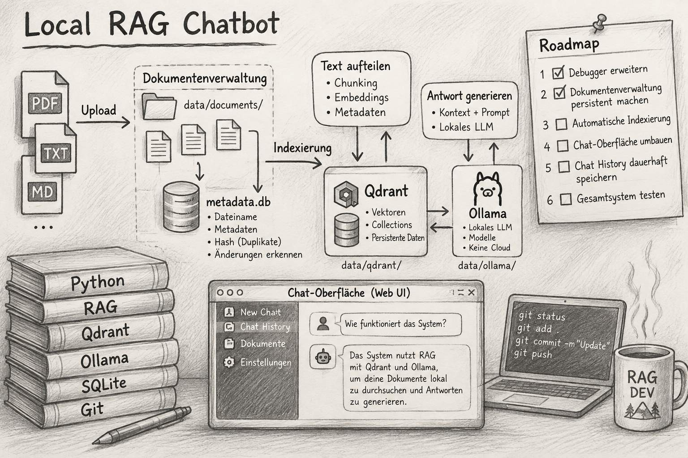

# Lokaler RAG Chatbot - basierend auf Ollama, Qdrant, SQLite und Streamlit.

<p></p>

       

---

## Beschreibung

Ein vollständig lokal betriebenes Retrieval-Augmented-Generation-(RAG)-Lab zum Verstehen und Erproben einer dokumentenbasierten KI-Anwendung.

Das Projekt kombiniert eine Streamlit-Weboberfläche mit einer selbst implementierten RAG-Pipeline. Dokumente werden eingelesen, in Textabschnitte (Chunks) zerlegt, in Embeddings umgewandelt und in einer Qdrant-Vektordatenbank gespeichert. Bei einer Benutzerfrage sucht der Retriever passende Chunks. Ein lokales Sprachmodell verwendet diese Informationen anschließend zur Antwortgenerierung.

Ziel ist eine nachvollziehbare, lokal ausführbare Lernumgebung, in der sich die einzelnen Schritte einer RAG-Anwendung untersuchen und debuggen lassen.

## Funktionen

- Lokale Chat-Oberfläche auf Basis von Streamlit
- Upload von PDF-, TXT- und Markdown-Dateien
- Extraktion und Aufbereitung von Dokumentinhalten
- Aufteilung der Texte in Chunks mit Metadaten
- Erstellung von Embeddings mit Ollama
- Speicherung und semantische Suche in Qdrant
- Antwortgenerierung durch ein lokal ausgeführtes LLM
- Anzeige der verwendeten Quellen und abgerufenen Chunks
- Debug-Ansicht zur Untersuchung von Indexierung, Retrieval, Similarity Scores und Prompt-Kontext
- Persistente Speicherung der Dokumente und Vektordaten für die Wiederverwendung nach einem Neustart

## Architektur

```text
                      ┌─────────────────────────────┐
                      │        Streamlit UI         │
                      │                             │
                      │  Chatbot       Chat Debug   │
                      └──────────────┬──────────────┘
                                     │
                       Benutzerfrage │ / Dokument-Upload
                                     ▼
                      ┌─────────────────────────────┐
                      │       RAG-Anwendung         │
                      │                             │
                      │  Document Loader            │
                      │  Text Splitter              │
                      │  Embedding-Modul            │
                      │  Vector Store / Retriever   │
                      │  Context Builder            │
                      │  LLM-Aufruf                 │
                      └───────┬─────────────┬───────┘
                              │             │
                    Embeddings│             │Prompt / Antwort
                              ▼             ▼
                   ┌────────────────┐  ┌────────────────┐
                   │    Qdrant      │  │     Ollama     │
                   │ Vector Store   │  │ Local LLM      │
                   └────────────────┘  └────────────────┘

             SQLite: Dokumenten-Metadaten und Indexierungsstatus
             Lokaler Speicher: Originaldokumente und Laufzeitdaten
```

### Komponenten

| Komponente | Aufgabe |
|---|---|
| **Streamlit** | Weboberfläche für Chat, Dokumentenverwaltung und Debugging |
| **RAG-Pipeline (Python)** | Orchestriert Dokumentenverarbeitung, Retrieval und Antwortgenerierung |
| **Ollama** | Führt das Embedding-Modell und das Chat-LLM lokal aus |
| **Qdrant** | Speichert Vektoren und Metadaten und führt die Ähnlichkeitssuche durch |
| **SQLite** | Verwaltet Dokumenteninformationen, Hashes und Indexierungsstatus |
| **Lokaler Dateispeicher** | Bewahrt hochgeladene Originaldokumente und persistente Anwendungsdaten auf |
| **Docker Compose** | Startet und verwaltet die Infrastrukturservices |

## Ablauf

### Dokumente indexieren

1. Ein Dokument wird über die Streamlit-Oberfläche hochgeladen.
2. Die Anwendung prüft das Dokument und erkennt Duplikate anhand seines Hashes.
3. Das Original wird lokal gespeichert; Metadaten werden in SQLite abgelegt.
4. Der Document Loader extrahiert den Text.
5. Der Text Splitter zerlegt den Inhalt in kleinere Chunks und ergänzt Metadaten.
6. Ollama erzeugt für die Chunks Embeddings.
7. Die Vektoren und zugehörigen Inhalte werden in Qdrant gespeichert.
8. Der Indexierungsstatus und die Anzahl der Chunks werden in SQLite aktualisiert.

### Eine Frage beantworten

1. Der Benutzer stellt eine Frage im Chat.
2. Die Frage wird in ein Embedding umgewandelt.
3. Qdrant sucht die semantisch ähnlichsten Chunks.
4. Der Context Builder bereitet die Treffer für den LLM-Aufruf auf.
5. Ollama generiert eine Antwort auf Basis der Frage und des bereitgestellten Kontexts.
6. Die Oberfläche zeigt die Antwort und die verwendeten Quellen an.

Die Debug-Ansicht macht wichtige Zwischenschritte sichtbar. So lässt sich beispielsweise prüfen, ob ein relevanter Textabschnitt indexiert wurde, ob er beim Retrieval gefunden wird und welche Similarity Scores die Treffer besitzen.

## Voraussetzungen

- Linux, macOS oder Windows mit einer geeigneten Docker-Umgebung
- Docker Engine und Docker Compose (Compose V2)
- Python 3.12 oder kompatible Version
- Ausreichend Arbeitsspeicher und freier Speicherplatz für Modelle und Dokumente

Das Projekt ist für den lokalen Betrieb ausgelegt. Die benötigten Ressourcen hängen insbesondere von der Größe des verwendeten Sprachmodells ab.

## Projekt starten

Die folgenden Befehle beziehen sich auf das Projektverzeichnis `02-rag-chatbot`.

### 1. Repository klonen

```bash
git clone <REPOSITORY-URL>
cd hth-ai-playground/02-rag-chatbot
```

### 2. Python-Umgebung einrichten

```bash
python3 -m venv .venv
source .venv/bin/activate
python -m pip install --upgrade pip
pip install -e .
```

### 3. Infrastruktur starten

```bash
docker compose up -d
```

Damit werden die in der Compose-Datei definierten Services gestartet, insbesondere Qdrant und Ollama.

Status prüfen:

```bash
docker compose ps
```

### 4. Ollama-Modelle bereitstellen

Die Anwendung verwendet derzeit folgende Modelle:

- **Embedding:** `nomic-embed-text:latest`
- **Chat-LLM:** `qwen3:1.7b`

Die Modelle müssen in der Ollama-Instanz verfügbar sein. Falls sie noch nicht vorhanden sind, können sie über die Ollama-CLI im laufenden Service geladen werden:

```bash
docker compose exec ollama ollama pull nomic-embed-text:latest
docker compose exec ollama ollama pull qwen3:1.7b
```

Die Namen des Compose-Services gegebenenfalls an die lokale `compose.yaml` anpassen.

### 5. Streamlit starten

```bash
streamlit run app/streamlit_app.py
```

Die von Streamlit ausgegebene lokale URL im Browser öffnen (standardmäßig `http://localhost:8501`).

### 6. Erste Schritte

1. Im linken Seitenbereich Dokumente hochladen.
2. **Upload and index** ausführen und warten, bis die Indexierung abgeschlossen ist.
3. Im Chat eine Frage zu den hochgeladenen Dokumenten stellen.
4. Die angezeigten Quellen und Chunks bei Bedarf prüfen.
5. Im Tab **Chatbot Debug** die Retrieval-Ergebnisse und weitere Pipeline-Schritte untersuchen.

## Tests

Die automatisierten Tests werden aus dem Projektverzeichnis gestartet:

```bash
pytest -v
```

Für manuelle Integrations- oder Funktionstests können die entsprechenden Skripte im Verzeichnis `tests/` verwendet werden. Diese können laufende Dienste wie Ollama und Qdrant voraussetzen.

## Daten und Persistenz

Die Anwendung speichert Dokumente, Metadaten und Vektordaten lokal. Die konkreten Speicherorte und Docker-Volumes sind in der Projektkonfiguration festgelegt.

- **SQLite:** Dokumenten-Metadaten und Indexierungsstatus
- **Dokumentenverzeichnis:** hochgeladene Originaldateien
- **Qdrant:** Chunks, Vektoren und zugehörige Payloads
- **Ollama:** lokal bereitgestellte Modelle

Die Laufzeitdaten sind nicht als Quellcode zu verstehen und sollten vor einem Git-Commit nicht versehentlich eingecheckt werden. Die `.gitignore`-Datei enthält die entsprechenden Ausschlüsse.

Ein Neustart der Container sollte die Daten nicht löschen, solange die konfigurierten persistenten Volumes beziehungsweise lokalen Datenverzeichnisse erhalten bleiben. Das Entfernen von Volumes kann dagegen gespeicherte Daten unwiederbringlich löschen.

## Projektstruktur

```text
02-rag-chatbot/
├── app/
│   ├── rag/              # RAG-Module und Pipeline
│   ├── ui/               # Streamlit-Oberfläche und Debug-Ansicht
│   └── streamlit_app.py  # Einstiegspunkt der Webanwendung
├── data/                 # Lokale Dokumente und Metadaten (Laufzeitdaten)
├── tests/                # Automatisierte und manuelle Tests
├── compose.yaml          # Lokale Infrastruktur
├── pyproject.toml        # Python-Projekt- und Testkonfiguration
└── README.md
```

Die Verzeichnisstruktur kann sich im Zuge der Weiterentwicklung ändern. Maßgeblich ist der aktuelle Stand des Repositorys.

## Projektziel und Lernschwerpunkte

Das Projekt dient dem praktischen Verständnis der grundlegenden Bausteine einer RAG-Anwendung:

- Dokumentenverarbeitung und Chunking
- Embeddings und semantische Suche
- Vektordatenbanken und Metadaten
- Retrieval-Qualität und Similarity Scores
- Aufbau des Kontexts für ein Sprachmodell
- Lokale LLM-Inferenz
- Debugging und Bewertung von RAG-Antworten
- Persistenz und Zusammenspiel mehrerer Services

Die Implementierung ist bewusst modular aufgebaut, damit einzelne Komponenten nachvollzogen, getestet und bei Bedarf durch alternative Implementierungen ersetzt oder verglichen werden können.

## Lizenz

Dieses Projekt ist ein persönliches Lern- und Entwicklungsprojekt. Eine Lizenz kann bei Bedarf im Repository ergänzt werden.
