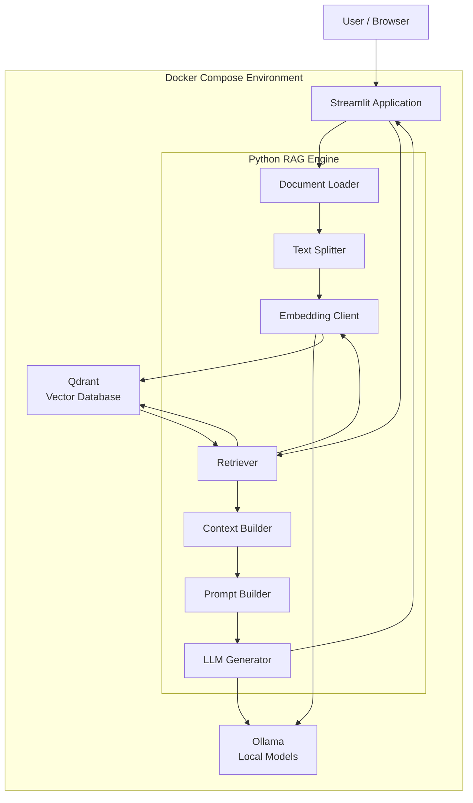
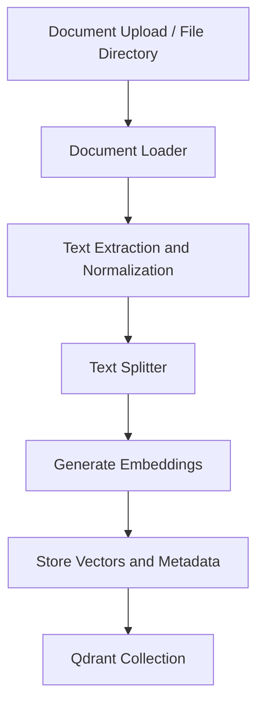
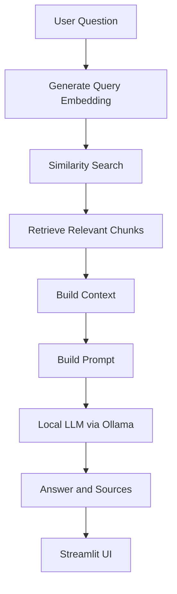

# Architecture – Local RAG Chatbot

## 1. Project Overview

### 1.1 Purpose

The purpose of this project is to build a fully local Retrieval-Augmented Generation (RAG) chatbot for personal use, technical demonstrations, and learning.

The application allows users to upload documents, ask questions about their content, and receive answers generated by a locally running Large Language Model (LLM).

The system combines document processing, vector search, and local language model inference in a single application.

The project is designed to run in a resource-constrained environment, such as a Linux virtual machine hosted in VirtualBox.

### 1.2 Project Goals

The main goals are:

- Build a fully local RAG application without external AI APIs.
- Use Ollama for local LLM inference and embedding generation.
- Use Qdrant as the vector database.
- Provide a simple graphical user interface based on Streamlit.
- Offer a user-friendly chatbot interface and a separate technical debug interface.
- Support document upload and ingestion.
- Display the sources used to generate answers.
- Make the complete environment reproducible through Docker Compose.
- Keep the implementation modular, understandable, and easy to extend.
- Use a custom Python RAG implementation before evaluating frameworks such as LlamaIndex.

### 1.3 Project Scope

The initial implementation focuses on a single-user environment.

The application is intended for personal use and technical demonstrations rather than production deployment or multi-user operation.

The initial version will support:

- PDF documents
- Plain text files (TXT)
- Markdown files (MD)

Additional formats, such as HTML or DOCX, may be considered later.

OCR, authentication, multi-user support, and production-grade high availability are outside the initial scope.

---

## 2. High-Level Architecture

The system consists of four main components:

1. Streamlit – User interface
2. Python RAG Engine – Document processing and retrieval logic
3. Ollama – Local embeddings and LLM inference
4. Qdrant – Vector storage and similarity search

All components run locally and communicate over a dedicated Docker Compose network.

### 2.1 Architecture Diagram

The diagram represents the logical architecture. The RAG Engine is implemented as Python modules within the Streamlit application and the ingestion command-line process. It is not a separate permanently running microservice in the initial version.

---

## 3. Component Architecture

### 3.1 Streamlit Application

Streamlit provides the graphical user interface.

The application consists of one Streamlit instance with two tabs.

#### Chatbot Tab

The chatbot tab is the primary user interface.

Its responsibilities include:

- Uploading documents
- Displaying document and indexing status
- Accepting user questions
- Displaying generated answers
- Showing source references
- Maintaining a small chat history

The interface should remain simple and accessible to users who are not familiar with the underlying RAG implementation.

#### Debug Chatbot Tab

The debug tab provides technical insight into the RAG pipeline.

It is based on the debug functionality of the existing `01-rag` learning project and will be adapted to the local Ollama and Qdrant environment.

The debug interface should display:

- User question
- Query embedding information
- Retrieved chunks
- Similarity scores
- Source documents and metadata
- Assembled context
- Final prompt sent to the LLM
- Selected model and generation parameters
- Generated answer

Both tabs use the same RAG Engine and the same Qdrant collection.

The two interfaces differ only in how they present the processing results.

### 3.2 Python RAG Engine

The RAG Engine contains the core application logic.

It is implemented as independent Python modules to separate responsibilities and simplify testing.

Planned modules:

| Module | Responsibility |
|---|---|
| `document_loader.py` | Read and extract text from supported document formats |
| `text_splitter.py` | Divide extracted text into smaller chunks |
| `embeddings.py` | Generate embeddings through Ollama |
| `vector_store.py` | Store and retrieve vectors using Qdrant |
| `retriever.py` | Find relevant chunks for a user question |
| `context_builder.py` | Assemble retrieved chunks into a context |
| `prompt_builder.py` | Construct the prompt for the LLM |
| `generator.py` | Send prompts to Ollama and process generated answers |

The RAG Engine must not depend on Streamlit-specific UI code.

This separation allows the processing logic to be tested independently and reused by both the graphical interface and the ingestion process.

### 3.3 Ollama

Ollama provides local model inference.

It is responsible for two distinct tasks:

1. Generating embeddings for documents and user questions.
2. Generating natural-language answers using a local chat model.

The embedding model and the chat model are separate components and may have different resource requirements.

The final model selection is an open decision and must be validated in the target VirtualBox environment.

The initial implementation should prioritize:

- Low memory consumption
- Acceptable CPU inference speed
- Sufficient answer quality
- Compatibility with the selected embedding model
- Appropriate context length

No external LLM API is used.

### 3.4 Qdrant

Qdrant is the vector database used to store document embeddings and associated metadata.

Its responsibilities include:

- Persisting vectors
- Storing document chunks and metadata
- Performing similarity searches
- Returning relevant chunks for user questions

The project uses its own independent Qdrant collection.

Existing data from `01-rag` is not migrated.

The Qdrant data directory is persisted through a Docker volume to ensure that indexed documents remain available after container restarts.

---

## 4. Data Flow

The application consists of two separate processing pipelines:

1. Document ingestion
2. Question answering

### 4.1 Document Ingestion Pipeline

The ingestion pipeline processes documents and stores their embeddings in Qdrant.

Processing steps:

1. Read supported documents.
2. Extract and normalize text.
3. Generate document identifiers and content hashes.
4. Split text into smaller chunks.
5. Generate embeddings using the selected embedding model.
6. Store vectors, text, and metadata in Qdrant.
7. Report processing statistics and errors.

The ingestion process is executed separately from the question-answering pipeline.

For the initial version, a full collection rebuild is sufficient. Incremental updates and automatic deletion of outdated documents can be implemented later.

### 4.2 Question Answering Pipeline

The query pipeline retrieves relevant document chunks and uses them as context for answer generation.

Processing steps:

1. Receive the user's question.
2. Generate an embedding using the same embedding model used during ingestion.
3. Search Qdrant for similar document chunks.
4. Retrieve the most relevant results.
5. Assemble the retrieved text into a context.
6. Construct a prompt containing the question and context.
7. Send the prompt to the local Ollama model.
8. Return the generated answer and source references.
9. Display the answer and sources in Streamlit.

The model should be instructed to answer based on the provided context and to indicate when the available information is insufficient.

---

## 5. Data Model

Each stored chunk contains its text, embedding, and metadata.

Planned metadata fields:

| Field | Description |
|---|---|
| `chunk_id` | Unique identifier for a chunk |
| `document_id` | Identifier of the original document |
| `source` | Original document name or path |
| `file_type` | Document format |
| `chunk_index` | Position of the chunk within the document |
| `text` | Extracted text of the chunk |
| `content_hash` | Hash used to identify document changes |
| `created_at` | Timestamp of ingestion |
| `embedding_model` | Model used to generate the embedding |

The exact Qdrant payload schema will be finalized during implementation.

The chunk text is stored alongside its vector so that retrieved content can be used directly to construct the LLM context.

---

## 6. Docker Architecture

Docker Compose is used to start and manage the application components.

Planned services:

| Service | Purpose |
|---|---|
| `streamlit` | Graphical user interface and RAG application |
| `ollama` | Local model inference and embedding generation |
| `qdrant` | Persistent vector database |
| Ingestion CLI | On-demand document processing |

The ingestion process is executed on demand and does not need to run as a permanent service.

### 6.1 Networking

All services communicate over a dedicated Docker Compose network.

Internal communication uses Docker service names rather than fixed container IP addresses.

The Streamlit application communicates with:

- Ollama through its internal service endpoint
- Qdrant through its internal API endpoint

Only the ports required for user access or administration should be published to the host.

### 6.2 Persistence

Persistent storage is required for:

- Ollama model files
- Qdrant database data
- Uploaded and indexed source documents

Container restarts must not require models to be downloaded again or documents to be re-indexed.

### 6.3 Resource Constraints

The environment is designed for CPU-based operation in VirtualBox.

Resource consumption must be evaluated during implementation.

The final model selection depends on:

- Available VM memory
- CPU performance
- Model quantization
- Context length
- Embedding model requirements
- Acceptable response time

GPU acceleration may be considered later if the environment supports it.

---

## 7. User Interface and Session Management

The Streamlit application provides two views of the same RAG functionality.

### Chatbot

The chatbot focuses on usability and answer presentation.

It maintains a small conversation history using Streamlit session state.

The initial implementation does not require a separate persistent conversation database.

### Debug Chatbot

The debug interface focuses on transparency and technical analysis.

It exposes intermediate processing results without duplicating the RAG logic.

Both tabs share the same processing functions and Qdrant collection.

---

## 8. Security and Privacy

The application is designed for local operation.

Security and privacy principles:

- No external AI APIs
- Documents remain within the local environment
- Models run locally through Ollama
- Qdrant is accessible only through the local Docker environment unless explicitly exposed
- Uploaded documents are not transmitted to external services
- Dependencies should be kept to a minimum
- Container and volume permissions should follow the principle of least privilege

The initial version is intended for a trusted single-user environment and does not implement authentication or multi-user authorization.

---

## 9. Relationship to Project 01-rag

The existing `01-rag` project is a learning and debugging environment.

It remains completely unchanged.

The new `02-rag-chatbot` project is independent and uses its own:

- Python environment
- Dependencies
- Docker Compose configuration
- Qdrant collection
- Document dataset
- Local Ollama models

Existing code from `01-rag` may be copied and adapted where appropriate.

There are no runtime imports or shared dependencies between the two projects.

The purpose of `01-rag` is to support learning and comparison, while `02-rag-chatbot` provides the integrated local chatbot application.

---

## 10. Design Decisions

| Decision | Rationale |
|---|---|
| Streamlit for the UI | Fast development of a functional graphical interface |
| One application with two tabs | Shared backend and consistent user experience |
| Python RAG implementation | Learning, transparency, and control over each processing step |
| Ollama for local inference | Local model execution without external AI APIs |
| Qdrant for vector storage | Dedicated vector search and persistent storage |
| Docker Compose | Reproducible and easy-to-start environment |
| Independent project structure | Clear separation from `01-rag` |
| Fresh document dataset | Avoid migration complexity and ensure reproducibility |
| Full re-indexing for MVP | Simpler initial implementation |
| Streamlit session state | Sufficient for a single-user demonstration |
| CPU-first deployment | Compatibility with the VirtualBox environment |

---

## 11. Future Considerations

The following enhancements are outside the initial implementation but may be evaluated later:

- Incremental document indexing
- Automatic detection of changed or deleted documents
- Additional document formats
- OCR for scanned PDFs
- Persistent chat history
- More advanced retrieval strategies
- Reranking
- Evaluation of answer quality and retrieval performance
- Comparison with LlamaIndex
- GPU acceleration
- Authentication and multi-user support

These features should only be introduced when they provide a clear benefit and do not unnecessarily complicate the initial implementation.

---

## 12. Open Decisions

The following details must be finalized during implementation:

- Exact Ollama chat model and quantization
- Exact embedding model
- Chunk size and overlap
- Number of retrieved chunks (`top_k`)
- Similarity threshold, if required
- Maximum context length
- Ollama generation parameters
- Exact Qdrant collection configuration
- Streamlit upload and indexing workflow

These values should be selected through practical testing rather than fixed prematurely in the architecture.

---

## 13. Summary

The Local RAG Chatbot is a modular, fully local application built with Streamlit, Python, Ollama, and Qdrant.

It combines a user-friendly chatbot interface with a technical debug view while sharing a single RAG Engine.

Docker Compose provides a reproducible runtime environment, and persistent volumes preserve models, documents, and vector data.

The architecture prioritizes simplicity, transparency, privacy, and resource efficiency while leaving room for future enhancements.
